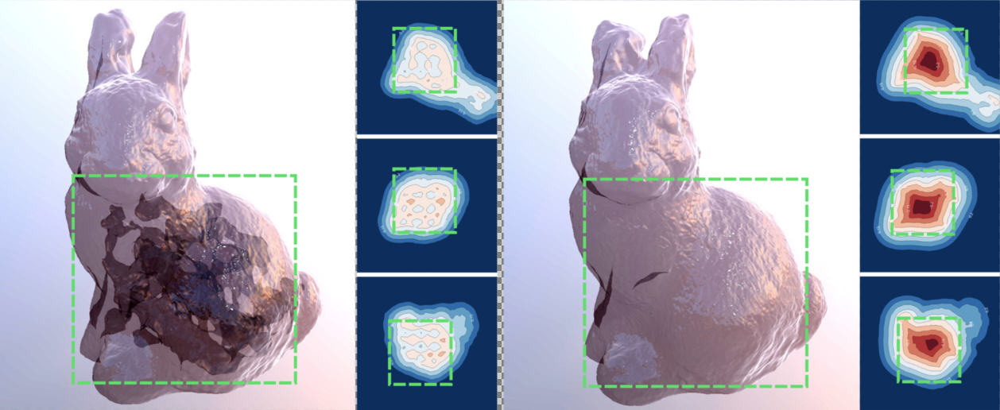
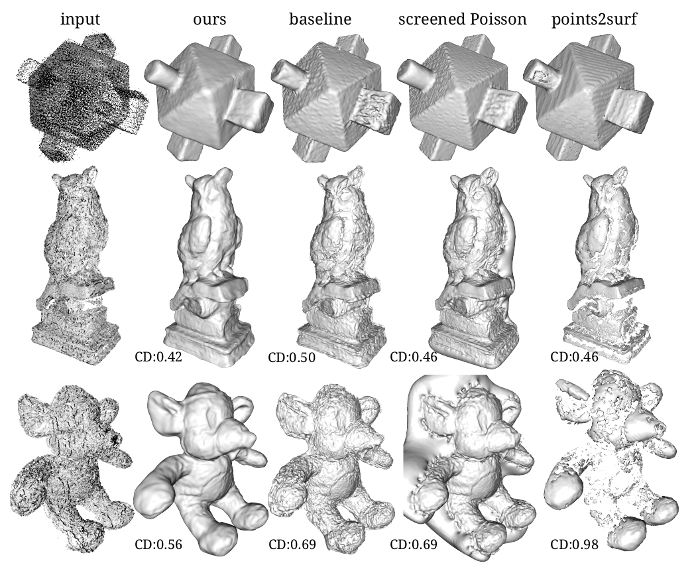

# Implementation for Iso-Points (CVPR 2021)
Official code for paper Iso-Points: Optimizing Neural Implicit Surfaces with Hybrid Representations

## Overview
<font size="5"> ***Iso-points*** </font> are well-distributed points which lie on the neural iso-surface, they are an explicit form of representation of the implicit surfaces. We propose using iso-points to augment the optimization of implicit neural surfaces.
The implicit and explicit surface representations are coupled, i.e. the implicit model determines the locations and normals of iso-points, whereas the iso-points can be utilized to control the optimization of the implicit model.

<font size="5"> ***The implementation*** </font> of the key steps for iso-points extraction is in `levelset_sampling.py` and `utils/point_processing.py`.
To demonstrate the utilisation of *iso-points*, we provide scripts for multiple applications and scenarios:
- [multiview reconstruction](#multiview-reconstruction)
  - [Demo 1](#sampling-with-iso-points): importance sampling with iso-points
  - [Demo 2](#DTU-data): [Multiview Neural Surface Reconstruction][IDR] on [DTU] data with iso-points
- [surface reconstruction from sparse point cloud](#implicit-surface-to-noisy-point-cloud)

## Demo
### Installation
This code is built as an extension of out Differentiable Surface Splatting pytorch library ([DSS](https://github.com/yifita/dss)), which depends on [pytorch3d](https://github.com/facebookresearch/pytorch3d), [torch_cluster](https://github.com/rusty1s/pytorch_cluster).
<span style="color:rgb(107,79,187)">**Currently we support up to pytorch 1.6**</span>.

````bash
git clone --recursive https://github.com/yifita/iso-points.git
cd iso-points

# conda environment and dependencies
# update conda
conda update -n base -c defaults conda
# install requirements
conda env create --name DSS -f environment.yml
conda activate DSS

# build additional dependencies of DSS
# FRNN - fixed radius nearest neighbors
cd external/FRNN/external
git submodule update --init --recursive
cd prefix_sum
python setup.py install
cd ../..
python setup.py install

# build batch-svd
cd ../torch-batch-svd
python setup.py install

# build DSS itself
cd ../..
python setup.py develop
````

## Demo
Download data
```bash
cd data
wget https://igl.ethz.ch/projects/iso-points/data.zip
unzip data.zip
rm data.zip
```
Including subset of masked [DTU data](https://www.dropbox.com/sh/5tam07ai8ch90pf/AADniBT3dmAexvm_J1oL__uoa) (courtesy of Yariv et.al.), synthetic rendered multiview data, and masked furu stereo reconstruction of DTU dataset.

### multiview reconstruction
#### sampling-with-iso-points
```bash
# train baseline implicit representation only using ray-tracing
python train_mvr.py configs/compressor_implicit.yml --exit-after 6000

# train with uniform iso-points
python train_mvr.py configs/compressor_uni.yml --exit-after 6000

# train with iso-points distributed according to loss value (hard example mining)
python train_mvr.py configs/compressor_uni_lossS.yml --exit-after 6000
```

### DTU-data
```bash
python train_mvr.py configs/dtu55_iso.yml
```

### implicit surface to noisy point cloud
```bash
python test_dtu_points.py data/DTU_furu/scan122.ply --use_off_normal_loss -o exp/points_3d_outputs/scan122_ours
```


## cite
Please cite us if you find the code useful!
```
@inproceedings{yifan2020isopoints,
      title={Iso-Points: Optimizing Neural Implicit Surfaces with Hybrid Representations},
      author={Wang Yifan and Shihao Wu and Cengiz Oztireli and Olga Sorkine-Hornung},
      year={2020},
      booktitle = {CVPR},
      year = {2020},
}
```

## Acknowledgement
We would like to thank Viviane Yang for her help with the point2surf code. This work was supported in
parts by Apple scholarship, SWISSHEART Failure Network (SHFN), and UKRI Future Leaders Fellowship [grant number MR/T043229/1]

[IDR]: https://github.com/lioryariv/idr
[DTU]: http://roboimagedata.compute.dtu.dk/?page_id=36
